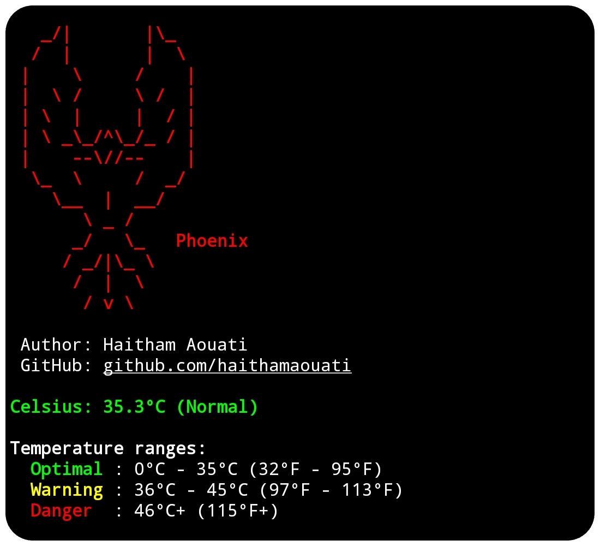

# Phoenix 🐦‍🔥
Get the temperature of the device battery.

## Preview



## Install

To use the Phoenix script, follow these steps:

1. Clone the repository:

    ```
    git clone https://github.com/haithamaouati/Phoenix.git
    ```

2. Change to the Phoenix directory:

    ```
    cd Phoenix
    ```
    
3. Change the file modes
    ```
    chmod +x phoenix.sh
    ```
    
5. Run the script:

    ```
    ./phoenix.sh
    ```

## Usage

Usage: `./phoenix.sh` `[options]`

##### Options:

`-c`, `--celsius`        Show temperature in Celsius _(default if no option)_

`-f`, `--fahrenheit`     Show temperature in Fahrenheit

`-c` `-f`                Show both Celsius and Fahrenheit

`-h`, `--help`           Show this help message

## Dependencies

The script requires the following dependencies:

- **termux-api**: `pkg install termux-api - y`
- **jq**: `pkg install jq -y`
- **bc**: `pkg install bc -y`

## Environment
- Tested on [Termux](https://termux.dev/en/)

## Disclaimer
> [!WARNING]
> We are not responsible for any misuse or damage caused by this program. use this tool at your own risk!

## License

Madara is licensed under [WTFPL](LICENSE).
